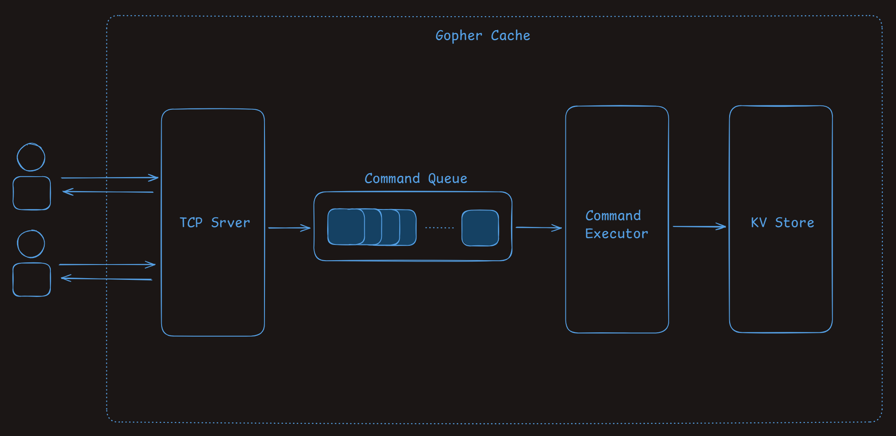
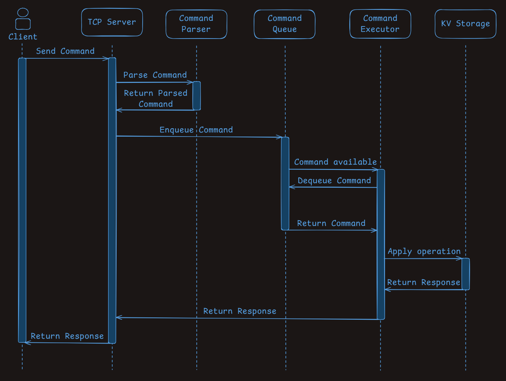

<p align="center">
  
  <br>
  <sub><em>By <a href="https://icon-icons.com/icon/golang-gopher-src-logo/168155">VectorLogoZone</a></em></sub>
</p>

# Table of Content

- [About](#about)
- [Features](#features)
- [Getting Started](#getting-started)
- [Architecture](#architecture)
  - [Core System Components](#core-system-components)
  - [Execution Flow](#execution-flow)
- [Performance](#performance)
- [Examples](#examples)

# About

Gopher Cache is a small in-memory database. It was built with the intention to mock a Redis database, so that it behaves similarly to the real one from the user/client perspective. The source code of the project is fully written in Go. The initial goal of this project was to build a mini copy of the Redis database to increase understanding of both the Redis internals and the Go programming language. However, everybody is welcome to check the code, propose improvements, create their own forks/versions, and use the source code for their own purposes.

> 📝 **Note:** This project is not intended to be a drop-in replacement for Redis.

# Features

- **RESP Command Parser:** Recursive-descent parser capable of parsing RESP arrays of bulk strings.
- **TCP Server:** Listens for incoming client connections and queues incoming commands for execution.
- **CLI Mode:** Provides an interactive, terminal-based interface for submitting RESP commands directly to the system. This mode is useful for manual testing, debugging, and exploring supported commands without requiring a TCP client.
- **FIFO Command Execution:** Commands are executed in first-in-first-out order as they arrive to the server.
- **Redis commands support:**
  | Command | Redis Docs | Supported | Notes |
  | ------------- |:-------------| :-----:| ---- |
  | PING | [https://redis.io/docs/latest/commands/ping](https://redis.io/docs/latest/commands/ping/) | ✅ | |
  | SET | [https://redis.io/docs/latest/commands/set](https://redis.io/docs/latest/commands/set/) | ⚠️ | (supported without options) |
  | GET | [https://redis.io/docs/latest/commands/get](https://redis.io/docs/latest/commands/get/) | ✅ | |
  | HSET | [https://redis.io/docs/latest/commands/hset](https://redis.io/docs/latest/commands/hset/) | ✅ | |
  | HGET | [https://redis.io/docs/latest/commands/hget](https://redis.io/docs/latest/commands/hget/) | ✅ | |
  | HMGET | [https://redis.io/docs/latest/commands/hmget](https://redis.io/docs/latest/commands/hmget/) | ✅ | |
  | LPUSH | [https://redis.io/docs/latest/commands/lpush](https://redis.io/docs/latest/commands/lpush/) | ✅ | |
  | RPUSH | [https://redis.io/docs/latest/commands/rpush](https://redis.io/docs/latest/commands/rpush/) | ✅ | |
  | LPOP | [https://redis.io/docs/latest/commands/lpop](https://redis.io/docs/latest/commands/lpop/) | ✅ | |
  | RPOP | [https://redis.io/docs/latest/commands/rpop](https://redis.io/docs/latest/commands/rpop/) | ✅ | |
  | LLEN | [https://redis.io/docs/latest/commands/llen](https://redis.io/docs/latest/commands/llen/) | ✅ | |
  | SADD | [https://redis.io/docs/latest/commands/sadd](https://redis.io/docs/latest/commands/sadd/) | ✅ | |
  | SREM | [https://redis.io/docs/latest/commands/srem](https://redis.io/docs/latest/commands/srem/) | ✅ | |
  | SCARD | [https://redis.io/docs/latest/commands/scard](https://redis.io/docs/latest/commands/scard/) | ✅ | |
  | SISMEMBER | [https://redis.io/docs/latest/commands/sismember](https://redis.io/docs/latest/commands/sismember/) | ✅ | |

# Getting Started

This section shows how to build and run Gopher Cache locally.

#### Prerequisites

- Go 1.25 or newer

#### Build

```bash
git clone https://github.com/MaksMakarskyi/gopher-cache
cd gopher-cache
go build ./cmd/gopher-cache
```

#### Run

```bash
./gopher-cache --mode <MODE> --host <HOST> --port <PORT> --queueSize <QUEUESIZE>
```

**Options:**

- MODE - Run mode: 'server' listens for TCP connections, 'cli' reads commands from stdin (default "server")
- HOST - Address to bind the TCP server to (default "localhost")
- PORT - TCP port the server listens on (default "6379")
- QUEUESIZE - Maximum number of commands buffered in the command queue (default 100)

#### Test

```bash
go test ./...
```

# Architecture

## Core System Components

<p align="center">
  
  <br>
  <sub><em>Core components of Gopher Cache</em></sub>
</p>

#### TCP Server

The TCP server listens for incoming client connections on a configurable address and port. It acts as the entry point into the system and is responsible for receiving raw RESP-encoded commands and dispatching them for execution.

Internally, the server coordinates several core components: a command parser and a command queue. Each incoming command is parsed into a structured representation containing the command name and its arguments, then packaged into a command object and enqueued for execution.

The connection handler waits for the corresponding response and returns it to the client, preserving a synchronous request–response flow while allowing command execution to be decoupled from network I/O.

> 📝 **Note:** It is also possible to test the Gopher Cache in CLI mode instead of sending the commands via TCP connection. See [Using CLI](#using-cli)

#### Command Queue

The Command Queue provides a thread-safe mechanism for decoupling command ingestion from command execution.

It acts as an intermediate buffer between the TCP server and the command executor, ensuring that commands are processed in a predictable order while allowing multiple client connections to submit commands concurrently.

#### Command Executor

The Command Executor is responsible for applying parsed commands to the underlying storage engine and producing protocol-compliant responses.

It synchronously processes commands from the Command Queue, dispatches them to the appropriate command handlers, and returns the result to the waiting client connection.

#### KV Store

The Storage Engine maintains an in-memory mapping of keys to typed values such as strings, lists, sets, and hashmaps. Each command handler function validates the expected type and either applies the requested mutation or returns a protocol-compatible error.

## Execution Flow

The following sequence diagram illustrates the process of receiving, parsing, queuing, executing, and responding to a single client command.

<p align="center">
  
  <br>
  <sub><em>Execution Flow Sequence Diagram</em></sub>
</p>

# Performance

The following benchmarks provide a baseline performance.

> 📝 **Note:** You can check out benchmark tests in `./benchmark` folder. See [Benchmarks](./benchmark/)

**Environment:**

- Go: 1.25
- OS: Windows (amd64)
- CPU: 11th Gen Intel(R) Core(TM) i5-11400H @ 2.70GHz

#### Throughput

Throughput benchmarks were executed over a localhost TCP connection using Go’s benchmarking framework. Throughput values are derived from average end-to-end latency measurements (5 runs).

| Command | Throughput (ops/sec) |
| ------- | :------------------: |
| SET     |        30,156        |
| GET     |        30,015        |
| HSET    |        29,775        |
| HGET    |        29,297        |
| LPUSH   |        29,936        |
| LLEN    |        30,316        |
| SADD    |        30,366        |
| SCARD   |        30,289        |

# Examples

#### Using Go

Below is a minimal Go example that demonstrates how to send a RESP-encoded command to the server over TCP and read the server response. First, start the server:

```bash
./gopher-cache --mode server --host localhost --port 6379
```

or simply

```bash
./gopher-cache
```

By default, the server listens on localhost:6379. Then, run the following client code:

```go
import (
  "fmt"
  "net"
)

func main() {
  // Specify the server address, example: "localhost:6379"
  conn, err := net.Dial("tcp", "<ADDRESS>")
  if err != nil {
    // handle error
  }
  defer conn.Close()

  // Send RESP-encoded command, example: "*2\r\n$3\r\nGET\r\n$3\r\nfoo\r\n"
  _, err = conn.Write([]byte("<RESP_ENCODED_COMMAND>"))
  if err != nil {
    // handle error
  }

  // Read Response
  resp := make([]byte, 1024)
  n, err := conn.Read(resp)
  if err != nil {
    // handle error
  }
  fmt.Println(string(resp[:n]))
}
```

#### Using Python

This section demonstrates how to interact with Gopher Cache using a minimal Python TCP client. The example mirrors the Go snippet above, but is implemented in Python. First, start the server (if it is not already running):

```bash
./gopher-cache --mode server --host localhost --port 6379
```

or simply

```bash
./gopher-cache
```

Then, run the code snippet from `.py` file:

```python
import socket

HOST = <HOST> # specify the host, example: "localhost"
PORT = <PORT> # specify the port, example: 6379

with socket.socket(socket.AF_INET, socket.SOCK_STREAM) as s:
    # Connect to the server
    s.connect((HOST, PORT))

    # Send RESP-encoded command, example: "*2\r\n$3\r\nGET\r\n$3\r\nfoo\r\n"
    s.sendall(b"<RESP_ENCODED_COMMAND>")

    # Read response
    data = s.recv(1024)

print(data.decode())
```

#### Using CLI

Here are some examples of how you can run Gopher Cache in CLI mode and execute commands.

```bash
# Run in CLI mode
./gopher-cache --mode cli

# SET Command
🐹> SET foo bar
"OK"

# GET Command
🐹> GET foo
"bar"

# LPUSH Command & integer response
🐹> LPUSH mylist foo bar fizz bazz
(integer) 4

# LPOP Command & array response
🐹> LPOP mylist 4
1) "bazz"
2) "fizz"
3) "bar"
4) "foo"

# WRONGTYPE error
🐹> SREM mylist add
(error) WRONGTYPE Operation against a key holding the wrong kind of value

# LPOP against non-existing key & nil response
🐹> LPOP my_nonexisting_list
(nil)
```
